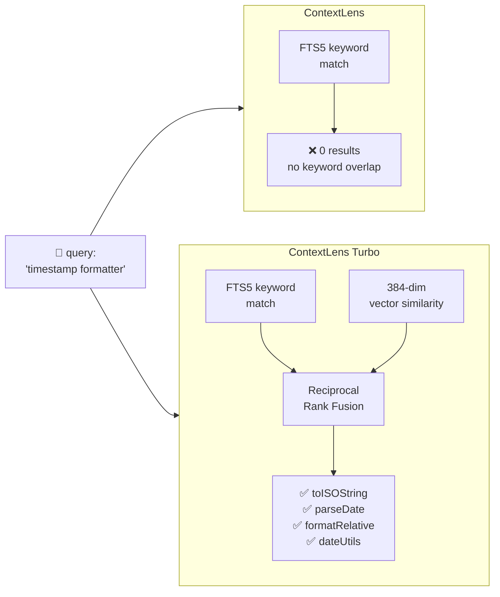
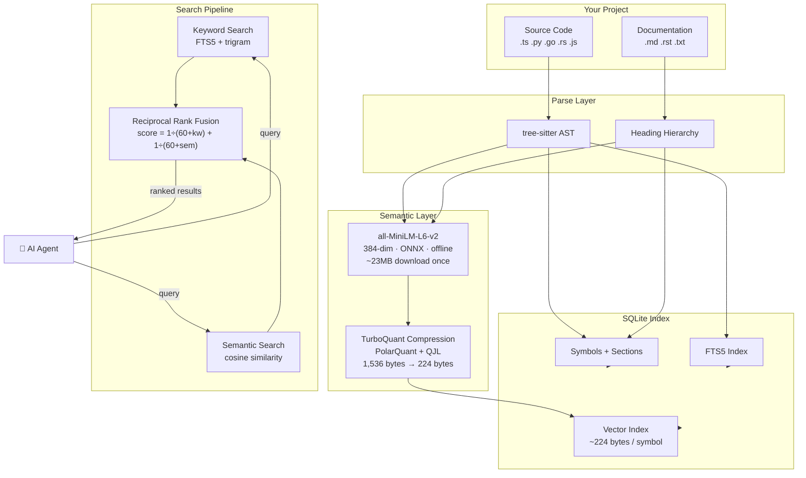
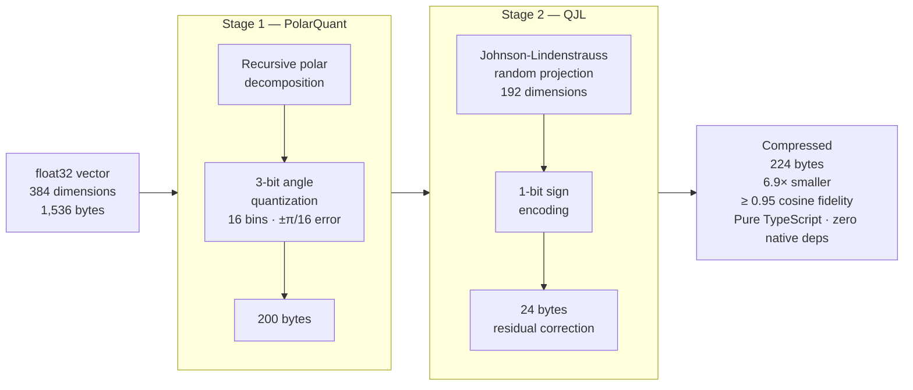
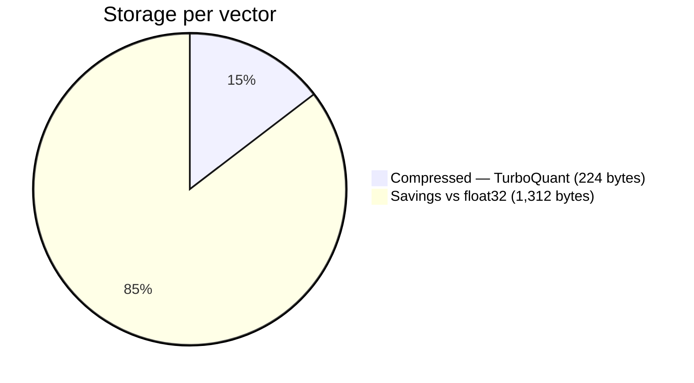
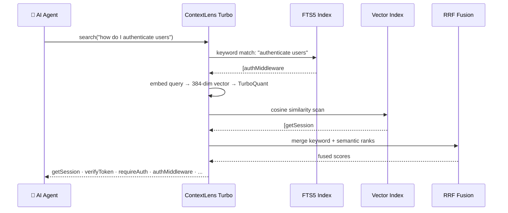
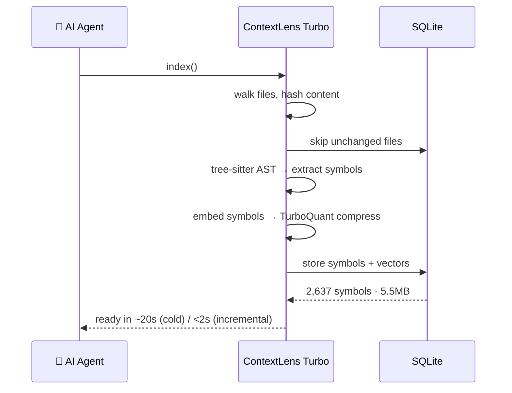
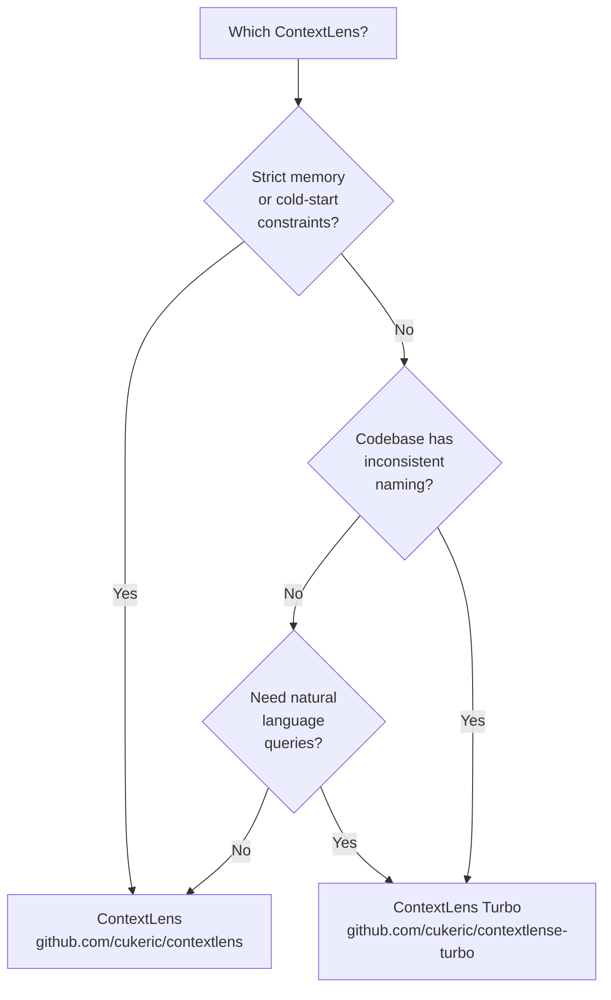

<div align="center">

# ContextLens Turbo

**Semantic MCP server — hybrid vector + keyword retrieval for AI coding agents**

[](https://www.npmjs.com/package/@cukeric/contextlens-turbo)
[](https://nodejs.org)
[](LICENSE)
[](https://modelcontextprotocol.io)
[](#how-it-works)

The original ContextLens retrieves code precisely. **Turbo understands what you mean.**

*Natural language queries · Offline embeddings · 6.9× compressed vectors · Zero API keys*

</div>

---

## ContextLens vs ContextLens Turbo



| Capability | ContextLens | ContextLens Turbo |
|---|:---:|:---:|
| Keyword search (FTS5 + trigram) | ✅ | ✅ |
| Fuzzy / stemmed matching | ✅ | ✅ |
| **Semantic / vector search** | ✗ | ✅ |
| **Natural language queries** | ✗ | ✅ |
| **Hybrid ranking (RRF fusion)** | ✗ | ✅ |
| **Semantic context neighbors** | ✗ | ✅ |
| Offline — no API keys | ✅ | ✅ |
| Graceful FTS5 fallback | N/A | ✅ |
| Storage per indexed symbol | 0 bytes | ~224 bytes |
| Embedding model | None | `all-MiniLM-L6-v2` (ONNX, offline) |

---

## Architecture



---

## TurboQuant Compression Pipeline

Raw embedding vectors are 1,536 bytes each. TurboQuant compresses them in two stages:





---

## Hybrid Search Flow



---

## Index Pipeline



---

## Token Savings

```mermaid
xychart-beta
    title "Tokens consumed — Full file read vs ContextLens Turbo"
    x-axis ["Find function", "Semantic NL search", "Context + neighbors", "Explore codebase"]
    y-axis "Tokens" 0 --> 45000
    bar [3200, 15000, 22000, 40000]
    bar [800, 1400, 4200, 6000]
```



| Scenario | Full read | ContextLens Turbo | Savings |
|----------|----------:|:-----------------:|:-------:|
| Find one function in 800-line file | 3,200 | 800 | **75%** |
| Semantic search with natural language | 15,000 | 1,400 | **91%** |
| `context` with semantic neighbors | 22,000 | 4,200 | **81%** |
| Explore unfamiliar codebase | 40,000+ | 6,000 | **85%** |

---

## Tools

Same 7 tools as ContextLens — `search` and `context` supercharged:

| Tool | What it does | Turbo enhancement |
|------|-------------|:-----------------:|
| `index` | Parse & index project (incremental) | Generates semantic vectors |
| `search` | Find symbols/sections by name | **Hybrid: keyword + semantic** |
| `get` | Retrieve content by ID with token budget | Unchanged |
| `outline` | File skeleton — symbols/headings | Unchanged |
| `references` | Find all usages of a symbol | Unchanged |
| `context` | Smart bundle — target + related | **Semantic neighbors** |
| `status` | Index stats, vector count, model state | Vector stats added |

**Tool description overhead: ~1,200 tokens** — identical to ContextLens.

---

## Natural Language Search in Practice

```
search("how do I authenticate users")
  → getSession, verifyToken, authMiddleware, requireAuth

search("database connection setup")
  → createPool, initDatabase, connectPrisma

search("format date for display")
  → formatDate, toRelativeTime, toISOString, dateUtils

search("error boundary handling")
  → ErrorBoundary, handleError, withErrorBoundary, fallbackUI
```

---

## Installation

### Option 1 — npx (Zero install, recommended)

```json
{
  "mcpServers": {
    "contextlens-turbo": {
      "type": "stdio",
      "command": "npx",
      "args": ["-y", "@cukeric/contextlens-turbo"]
    }
  }
}
```

### Option 2 — Global install

```bash
npm install -g @cukeric/contextlens-turbo
```

```json
{
  "mcpServers": {
    "contextlens-turbo": {
      "type": "stdio",
      "command": "contextlens-turbo"
    }
  }
}
```

### Option 3 — Local dev

```bash
git clone git@github.com:cukeric/contextlense-turbo.git
cd contextlense-turbo && npm install && npm run build
```

```json
{
  "mcpServers": {
    "contextlens-turbo": {
      "type": "stdio",
      "command": "node",
      "args": ["/path/to/contextlens-turbo/dist/index.js"]
    }
  }
}
```

---

## Agent Setup

<details>
<summary><strong>Claude Code</strong></summary>

Add `.mcp.json` to your project root. Claude Code reads it automatically.

The first `index` call downloads and caches the embedding model (~23MB) to `~/.contextlens-turbo/models/`. Subsequent sessions load it in ~200ms.

</details>

<details>
<summary><strong>Gemini CLI</strong></summary>

Add to `~/.gemini/settings.json`:

```json
{
  "mcpServers": {
    "contextlens-turbo": {
      "command": "npx",
      "args": ["-y", "@cukeric/contextlens-turbo"]
    }
  }
}
```

</details>

<details>
<summary><strong>GitHub Copilot (VS Code)</strong></summary>

Add to VS Code `settings.json`:

```json
{
  "github.copilot.chat.experimental.mcpServers": {
    "contextlens-turbo": {
      "command": "npx",
      "args": ["-y", "@cukeric/contextlens-turbo"]
    }
  }
}
```

</details>

<details>
<summary><strong>Cursor / Windsurf</strong></summary>

Add to `.cursor/mcp.json` or `.windsurf/mcp.json` using the same format as Claude Code.

</details>

---

## Performance

| Metric | ContextLens | ContextLens Turbo |
|--------|:-----------:|:-----------------:|
| Cold index (188-file project) | ~2s | ~20s |
| Incremental (3–5 changed files) | <100ms | <2s |
| Model load (first time) | N/A | ~3s + 23MB download |
| Model load (cached) | N/A | ~200ms |
| Search latency | ~15ms | ~20ms |
| DB size | 2.5 MB | ~5.5 MB |
| Bytes per vector | 0 | **224 bytes** |
| Compression ratio | N/A | **6.9:1** |

---

## Which Version Should I Use?



Both produce identical MCP tool schemas — swap between them without changing your agent workflow.

---

## Limitations

- **First-run model download** — ~23MB to `~/.contextlens-turbo/models/`. Fully cached after that.
- **No real-time file watching** — index updates on `index` calls, not on file changes.
- **Semantic search is approximate** — ≥0.95 cosine similarity, not lossless.
- **Memory** — embedding model holds ~50MB while the server runs.
- **Graceful fallback** — if the model fails to load, all 7 tools continue working via FTS5.

---

## License

MIT — Copyright (c) 2026 [Davor Cukeric](https://davor.cukeric.com) · [github.com/cukeric](https://github.com/cukeric)
